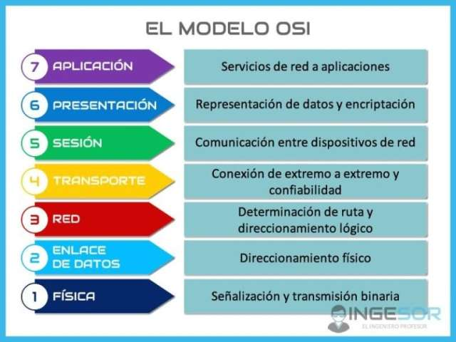

# Universidad Hacking. Ciberseguridad.

## Modelo OSI

### 1. Nivel Fisico

- Pasa de una señal electrica a una que pueda ser entendida por la red.
    - Codificacion de Datos
    - Deteccion de colisiones
    - Modulacion de señal
    - Procesamiento de la señal
    - Conversion analogica digital

- Aqui se debe impedir el paso de terceros no autorizados.

### 2. Enlace de Datos

- Comunica la capa de **Red** con la **Fisica**. Y transmitir los datos dentro del circuito de transferencia de datos.     
    - Establecimineto , control y finalizacion de los enlaces
    - Controla el volumen de informacion.
    - Control de Erropres y gestion.
    - Evita el flujo que sature el equipò siguiente

- Protocolos de seguridad WPA" o WPA estan aqui.
- Los Switches son ejemplo de un dispositovo importante  en esta capa.
- Hay que inutilizar los puertos que no se usan.

